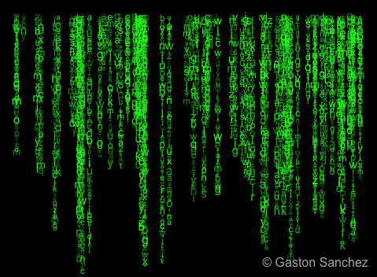

```{r setup, include=FALSE}
knitr::opts_chunk$set(
  fig.width = 5, fig.height = 3.5, fig.align = 'center',
  cache = TRUE)
```

## Outline

We will spend next couple lectures studying R. I'll closely follow a few great books by Hadley Wickham.

* Data wrangling (import, visualization, transformation, tidy).  
  [R for Data Science](http://r4ds.had.co.nz) by Garrett Grolemund and Hadley Wickham.

* R programming, Rcpp.  
  [Advanced R](http://adv-r.had.co.nz) by Hadley Wickham.

* R package development.  
  [R Packages](http://r-pkgs.had.co.nz) by Hadley Wickham.

* Web applications.

* Interface with SQL and Apache Spark.


##

A typical data science project:

<p align="center">

</p>

## Tidyverse

- `tidyverse` is a collection of R packages that make data wrangling easy.

- Install `tidyverse` from RStudio menu `Tools -> Install Packages...` or
    ```{r, eval = FALSE}
    install.packages("tidyverse")
    ```

- After installation, load `tidyverse` by
    ```{r}
    library("tidyverse")
    ```

## `dat` data {.smaller}

```{r}
library(plyr)
dat=mpg
colnames(dat)[3:11]=c("digestive_rate","year","cyl","trans","drv","population","age","fl","race")
dat$race=mapvalues(dat$race, from = c("2seater", "compact","midsize","minivan","pickup","subcompact","suv"), to = c("American Indian", "Black","Latino","Native Hawaiian","Asian","Other Pacific Islander","White"))
dat
```
    
- `digestive_rate` = displ: engine size, in litres.  
  `age` = hwy : highway fuel efficiency, in mile per gallen (mpg).
  `race` = class
  `population` = cty


# Aesthetic mappings | r4ds chapter 3.3

## Aesthetic {.smaller}

- Oxford Dictionary: Concerned with beauty or the appreciation of beauty.

- In plots: text & symbols can be seen directly. Scales, color, size, shape...

- One single dot may have a lot information 


## Scatter plot {.smaller}

- `Digestive rate`  vs  `Age` 
```{r} 
ggplot(data = dat) +
geom_point(mapping = aes(x = age, y = digestive_rate))
```

- Check available aesthetics for a geometric object by `?geom_point`. 

## Color of points {.smaller} 

- Color points according to `race`:
```{r}
ggplot(data = dat) +
geom_point(mapping = aes(x = age, y = digestive_rate, color = race))
```

## Size of points {.smaller}

- Color points according to `race`;
- Assign different sizes to points according to `population`:
```{r, warning = FALSE}
ggplot(data = dat) +
geom_point(mapping = aes(x = age, y = digestive_rate, color = race,size=population)) +
theme(legend.key.size = unit(0.35, "cm"))  
```

## Transparency of points {.smaller}

- Assign different transparency levels to points according to `year`:
```{r}
ggplot(data = dat) +
geom_point(mapping = aes(x = age, y = digestive_rate, alpha = year))
```

## Shape of points {.smaller}

- Assign different shapes to points according to `race`
  (without `scale_shape_manual` statement, only 6 shapes will be shown):
```{r, warning = FALSE}
ggplot(data = dat) +
geom_point(mapping = aes(x = age, y = digestive_rate, shape = race))+
  scale_shape_manual(values=1:7)
```


## Manual setting of an aesthetic {.smaller}

- The options in `aes` statement doesn't have to be a variable. 
  Set the color of all points to be blue:
```{r}
ggplot(data = dat) + 
geom_point(mapping = aes(x = age, y = digestive_rate), color = "blue")
```


# Facets | r4ds chapter 3.5

## Facets {.smaller}

- Facets divide a plot into subplots based on one or more categorical variables.
  Application: Subgroup analysis, Annual fluctuation...

- A subplot for each year:
```{r}
ggplot(data = dat) +
geom_point(mapping = aes(x = age, y = digestive_rate)) +
facet_wrap(~ year, nrow = 2)
```

##

- A subplot for each racial group and year:
```{r}
ggplot(data = dat[dat$race==c("Black","White","Asian"),]) +
geom_point(mapping = aes(x = age, y = digestive_rate)) + 
facet_grid(year ~ race )
```
    
# Geometric objects | r4ds chapter 3.6

## `geom_smooth()`: smooth line

- `hwy` vs `displ` line:
```{r, fig.width = 4.5, fig.height = 3, message = FALSE}
ggplot(data = mpg) +
geom_smooth(mapping = aes(x = displ, y = hwy))
```

## Different line types

- Different line types according to `drv`:
```{r, fig.width = 4.5, fig.height = 3, , message = FALSE}
ggplot(data = mpg) +
geom_smooth(mapping = aes(x = displ, y = hwy, linetype = drv))
```

## Different line colors

- Different line colors according to `drv`:
```{r, fig.width = 4.5, fig.height = 3, message = FALSE}
ggplot(data = mpg) +
geom_smooth(mapping = aes(x = displ, y = hwy, color = drv))
```

## Points and lines

- Lines overlaid over scatter plot:
```{r, fig.width = 4.5, fig.height = 3, message = FALSE}
ggplot(data = mpg) +
geom_point(mapping = aes(x = displ, y = hwy)) +
geom_smooth(mapping = aes(x = displ, y = hwy))
```

----

- Same as
```{r, fig.width = 4.5, fig.height = 3, message = FALSE}
ggplot(data = mpg, mapping = aes(x = displ, y = hwy)) +
geom_point() + geom_smooth()
```

## Aesthetics for each geometric object

- Different aesthetics in different layers:
```{r, fig.width = 4.5, fig.height = 3, message = FALSE}
ggplot(data = mpg, mapping = aes(x = displ, y = hwy)) +
geom_point(mapping = aes(color = class)) +
geom_smooth(data = filter(mpg, class == "subcompact"), se = FALSE)
```
    
# Bar charts | r4ds chapter 3.7

## `diamonds` data {.smaller}

- `diamonds` data:
```{r}
diamonds
```

## Bar chart

- `geom_bar()` creates bar chart:
```{r}
ggplot(data = diamonds) +
geom_bar(mapping = aes(x = cut))
```

----

- Bar charts, like histograms, frequency polygons, smoothers, and boxplots, plot some computed variables instead of raw data.

- Check available computed variables for a geometric object via help:
```{r, eval = FALSE}
?geom_bar
```

----

- Use `stat_count()` directly:
```{r}
ggplot(data = diamonds) +
stat_count(mapping = aes(x = cut))
```
- `stat_count()` has a default geom `geom_bar()`.

----

- Display frequency instead of counts:
```{r}
ggplot(data = diamonds) +
geom_bar(mapping = aes(x = cut, y = ..prop.., group = 1))
```

----

- Color bar:
```{r, results = 'hold'}
ggplot(data = diamonds) +
geom_bar(mapping = aes(x = cut, colour = cut))
```

----

- Fill color:
```{r, results = 'hold'}
ggplot(data = diamonds) +
geom_bar(mapping = aes(x = cut, fill = cut))
```

----

- Fill color according to another variable:
```{r}
ggplot(data = diamonds) +
geom_bar(mapping = aes(x = cut, fill = clarity))
```

# Positional arguments | r4ds chapter 3.8

----

- `position_gitter()` add random noise to X and Y position of each element to avoid overplotting:
```{r}
ggplot(data = mpg) +
geom_point(mapping = aes(x = displ, y = hwy), position = "jitter")
```

----

- `geom_jitter()` is similar:
```{r}
ggplot(data = mpg) +
geom_jitter(mapping = aes(x = displ, y = hwy))
```

----

- `position_fill()` stack elements on top of one another, normalize height:
```{r}
ggplot(data = diamonds) +
geom_bar(mapping = aes(x = cut, fill = clarity), position = "fill")
```

----

- `position_dodge()` arrange elements side by side:
```{r}
ggplot(data = diamonds) +
geom_bar(mapping = aes(x = cut, fill = clarity), position = "dodge")
```

----

- `position_stack()` stack elements on top of each other: 
```{r}
ggplot(data = diamonds) +
geom_bar(mapping = aes(x = cut, fill = clarity), position = "stack")
```


# Coordinate systems | r4ds chapter 3.9

## A boxplot {.smaller}

- Try: 
* coord_fixed(ratio = 1/2)
* coord_cartesian(xlim = c(0, 5))
* coord_flip()
```{r}
ggplot(data = dat, aes(x = factor(year), y = age)) +
geom_boxplot() 
```
     

## A map {.smaller}
```{r, message=F, warning=F}
library(maps)
```

```{r}
nz <- map_data("nz")
ggplot(nz, aes(long, lat, group = group)) +
geom_polygon(fill = "white", colour = "black")
```


##

- `coord_quickmap()` puts maps in scale:
```{r}
ggplot(nz, aes(long, lat, group = group)) +
geom_polygon(fill = "white", colour = "black") +
coord_quickmap() 
```

    
# Graphics for communications | r4ds chapter 28 

## Text Information {.smaller}

- Figure title should be descriptive
- Add lables for x and y axis 
- Use subtitle and caption to provide more info 
```{r, fig.width = 4.5, fig.height = 3, message = FALSE}
ggplot(dat, aes(x = age, y = digestive_rate)) +
geom_point(aes(color = race)) +
geom_smooth(se = FALSE) +
labs( x = "Age (y)",y = "Digestive Rate",title = "Digestive rate decreases with age",
     subtitle = "Total sample size = 234",
caption = "Derived from the mpg data from fueleconomy.gov")+
  theme(plot.caption  = element_text(hjust=0.2))
```

## Math equations {.smaller}

-
```{r, fig.width = 4.5, fig.height = 3}
df <- tibble(x = runif(10), y = runif(10))
ggplot(df, aes(x, y)) + geom_point() +
labs(
x = quote(sum(x[i] ^ 2, i == 1, n)),
y = quote(alpha + beta + frac(delta, theta))
)
```


## Annotations {.smaller}

- Create labels
```{r}
oldest_in_race <- dat %>%
group_by(race) %>%
filter(row_number(desc(age)) == 1)
oldest_in_race
```

##

- Annotate points
```{r}
ggplot(dat, aes(x = age, y = digestive_rate)) +
geom_point(aes(colour = race)) +
geom_text(aes(label = year), data = oldest_in_race)
## add 'hjust=0.4,nudge_y = 1,size = 2.3' to geom_text statement
```

##

```{r,echo=FALSE}
library("ggrepel")
```

- `ggrepel` package automatically adjust labels so that they don’t overlap:
```{r, fig.width = 4.5, fig.height = 3}
ggplot(dat, aes(x = age, y = digestive_rate)) +
geom_point(aes(colour = race)) +
geom_point(size = 3, shape = 1, data = oldest_in_race) +
ggrepel::geom_label_repel(aes(label = year), data = oldest_in_race)
```

## Scales

- automatically adds scales
```{r, eval = FALSE}
ggplot(dat, aes(x = age, y = digestive_rate)) +
geom_point(aes(colour = race)) +
scale_x_continuous() +
scale_y_continuous() +
scale_colour_discrete()
```

##

- `breaks` and `labels`
```{r}
ggplot(dat, aes(x = age, y = digestive_rate)) +
geom_point() +
scale_y_continuous(breaks = seq(0, 10, by = 2),
labels=c("","cut1","cut2","cut3","cut4","cut5"))
```

- Want to see 'cut5'? Add 'yend=10' to aes statement

##

- Plot y-axis at log scale:
```{r}
ggplot(dat, aes(x = age, y = digestive_rate)) +
geom_point() +
scale_y_log10(breaks = c(0,3,6,9)) 
```

##

- Plot x-axis in reverse order:
```{r}
ggplot(dat, aes(x = age, y = digestive_rate)) +
geom_point() +
scale_x_reverse()
```


## Zooming

- Without clipping (removes unseen data points)
```{r, message = FALSE}
ggplot(dat, aes(x = age, y = digestive_rate)) +
geom_point(aes(color = race)) +
coord_cartesian(ylim = c(0, 7), xlim = c(10, 20))
```
- Or with clipping: use `+xlim(10, 50) + ylim(0, 7)` 


##


- Set ranges of the axis in ggplot code
```{r, message = FALSE, warning = FALSE}
ggplot(dat, aes(x = age, y = digestive_rate)) +
geom_point(aes(color = race)) +
geom_smooth() +
scale_y_continuous(limits = c(0, 7)) +
scale_x_continuous(limits = c(20, 30))
```

##

- Modify the data (restrict the ranges) before plotting 
```{r, message = FALSE,eval=FALSE}
dat %>%
filter(digestive_rate >= 0, digestive_rate <= 7, age >= 20, age <= 30) 
%>% ggplot(aes(x = age, y = digestive_rate)) +
geom_point(aes(color = race)) +
geom_smooth()
```

# Themes |  'theme' almost controls every component of the plot except aesthetic  

## Change background {.smaller}
```{r, message = FALSE}
ggplot(dat, aes(x = age, y = digestive_rate)) +
geom_point(aes(color = race)) +
geom_smooth(se = FALSE) + 
  theme_dark() 
```


## Change legend {.smaller}

- 'legend' can be complicated: position, background, size, font...

```{r}
ggplot(dat, aes(x = age, y = digestive_rate)) +
geom_point(aes(colour = race)) +
theme(legend.position = "bottom",legend.direction = "horizontal",
legend.key.size = unit(1, 'lines'))
```

----

- See following link for more details on how to change title, labels, ... of a legend.

<http://www.sthda.com/english/wiki/ggplot2-legend-easy-steps-to-change-the-position-and-the-appearance-of-a-graph-legend-in-r-software>


## Saving plots

```{r, collapse = TRUE}
ggplot(dat, aes(x = age, y = digestive_rate)) + geom_point()
ggsave("my-plot.pdf")
```

## 

- Keep the cheat sheet at hand and Google code frame of the plot you want
- Find advanced plots & code: https://www.r-graph-gallery.com/
<p align="left">

</p>
